# PromptLab Architecture Documentation

This document provides visual diagrams and architectural overview of the PromptLab system.

## Table of Contents

1. [Data Model](#data-model)
2. [API Request Flow](#api-request-flow)
3. [Entity Relationships](#entity-relationships)
4. [Resource Lifecycle](#resource-lifecycle)
5. [System Architecture](#system-architecture)

---

## Data Model

### Pydantic Models Class Diagram

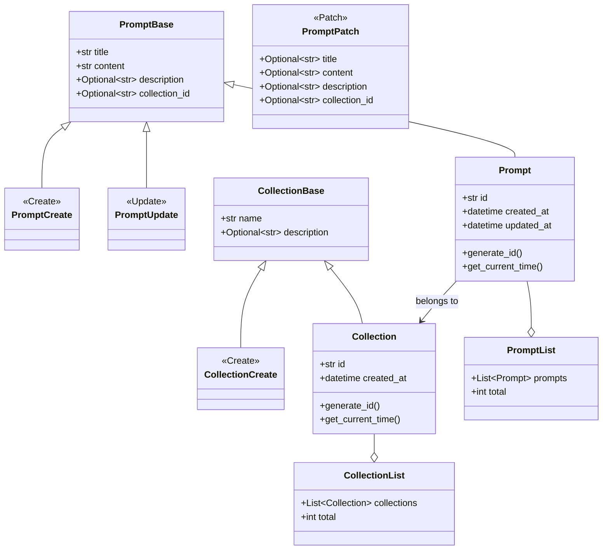
```mermaid
classDiagram
    class PromptBase {
        +str title
        +str content
        +Optional~str~ description
        +Optional~str~ collection_id
    }
    
    class PromptCreate {
        <<Create>>
    }
    
    class PromptUpdate {
        <<Update>>
    }
    
    class PromptPatch {
        <<Patch>>
        +Optional~str~ title
        +Optional~str~ content
        +Optional~str~ description
        +Optional~str~ collection_id
    }
    
    class Prompt {
        +str id
        +datetime created_at
        +datetime updated_at
        +generate_id()
        +get_current_time()
    }
    
    class CollectionBase {
        +str name
        +Optional~str~ description
    }
    
    class CollectionCreate {
        <<Create>>
    }
    
    class Collection {
        +str id
        +datetime created_at
        +generate_id()
        +get_current_time()
    }
    
    class PromptList {
        +List~Prompt~ prompts
        +int total
    }
    
    class CollectionList {
        +List~Collection~ collections
        +int total
    }
    
    PromptBase <|-- PromptCreate
    PromptBase <|-- PromptUpdate
    PromptBase <|-- Prompt
    CollectionBase <|-- CollectionCreate
    CollectionBase <|-- Collection
    
    Prompt --o PromptList
    Collection --o CollectionList
    Prompt --> Collection : belongs to
```

### Field Constraints

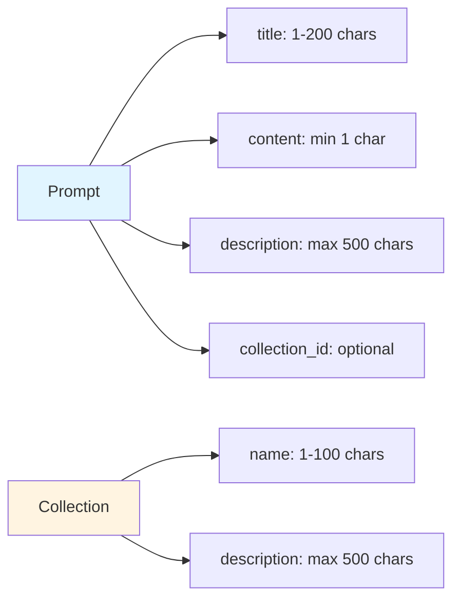
```mermaid
graph LR
    A[Prompt] --> B[title: 1-200 chars]
    A --> C[content: min 1 char]
    A --> D[description: max 500 chars]
    A --> E[collection_id: optional]
    
    F[Collection] --> G[name: 1-100 chars]
    F --> H[description: max 500 chars]
    
    style A fill:#e1f5ff
    style F fill:#fff4e1
```

---

## API Request Flow

### Create Prompt Flow

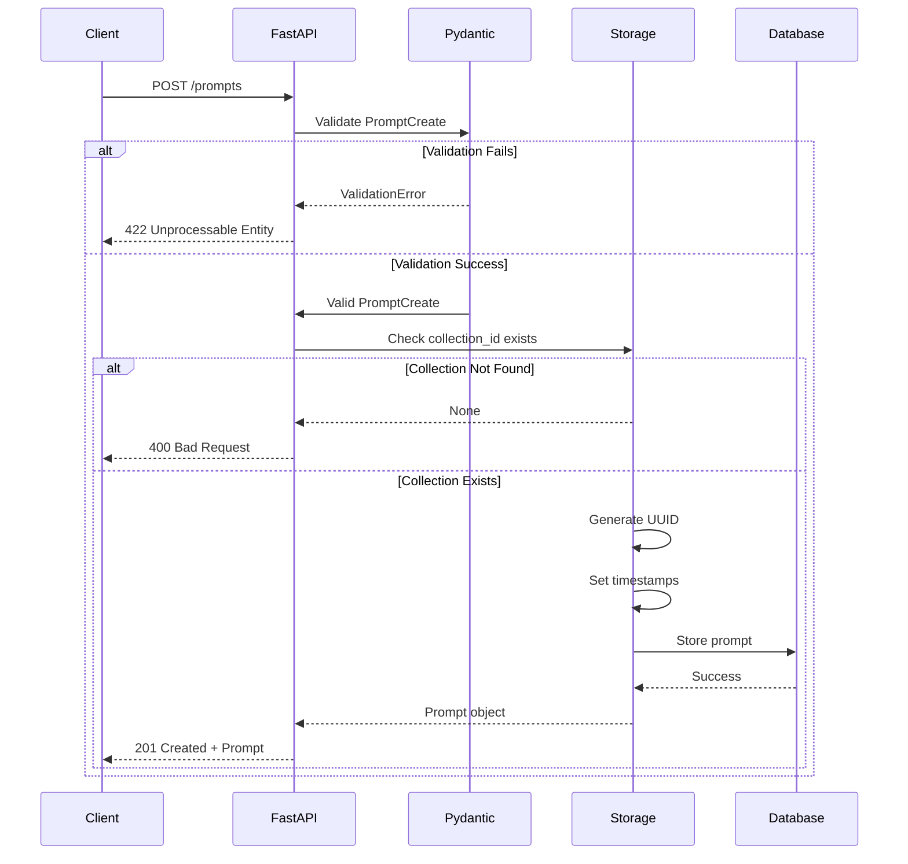
```mermaid
sequenceDiagram
    participant Client
    participant FastAPI
    participant Pydantic
    participant Storage
    participant Database
    
    Client->>FastAPI: POST /prompts
    FastAPI->>Pydantic: Validate PromptCreate
    
    alt Validation Fails
        Pydantic-->>FastAPI: ValidationError
        FastAPI-->>Client: 422 Unprocessable Entity
    else Validation Success
        Pydantic->>FastAPI: Valid PromptCreate
        FastAPI->>Storage: Check collection_id exists
        
        alt Collection Not Found
            Storage-->>FastAPI: None
            FastAPI-->>Client: 400 Bad Request
        else Collection Exists
            Storage->>Storage: Generate UUID
            Storage->>Storage: Set timestamps
            Storage->>Database: Store prompt
            Database-->>Storage: Success
            Storage-->>FastAPI: Prompt object
            FastAPI-->>Client: 201 Created + Prompt
        end
    end
```

### Get Prompt Flow

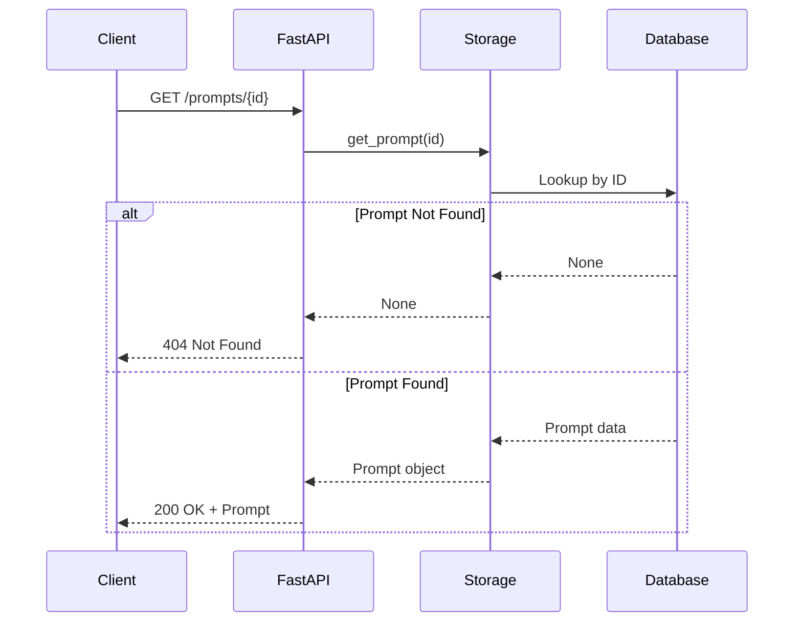
```mermaid
sequenceDiagram
    participant Client
    participant FastAPI
    participant Storage
    participant Database
    
    Client->>FastAPI: GET /prompts/{id}
    FastAPI->>Storage: get_prompt(id)
    Storage->>Database: Lookup by ID
    
    alt Prompt Not Found
        Database-->>Storage: None
        Storage-->>FastAPI: None
        FastAPI-->>Client: 404 Not Found
    else Prompt Found
        Database-->>Storage: Prompt data
        Storage-->>FastAPI: Prompt object
        FastAPI-->>Client: 200 OK + Prompt
    end
```

### List Prompts with Filters Flow

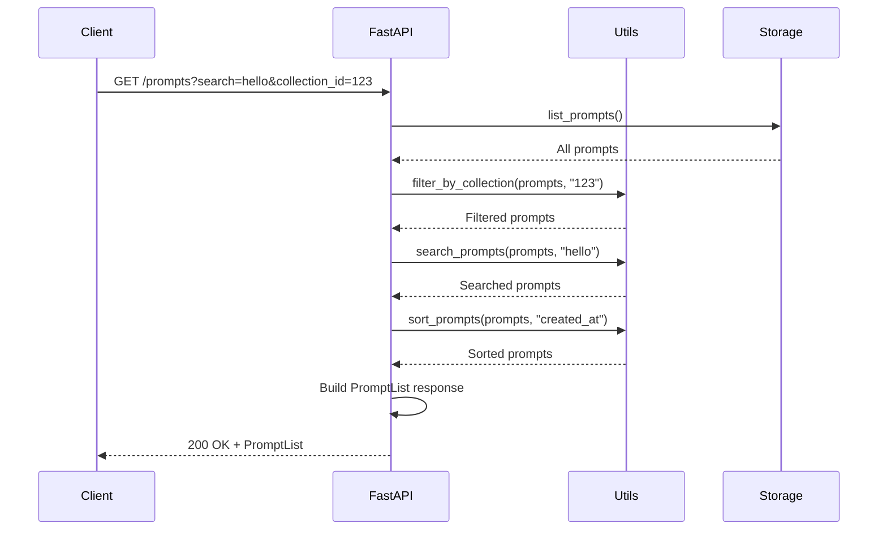
```mermaid
sequenceDiagram
    participant Client
    participant FastAPI
    participant Utils
    participant Storage
    
    Client->>FastAPI: GET /prompts?search=hello&collection_id=123
    FastAPI->>Storage: list_prompts()
    Storage-->>FastAPI: All prompts
    
    FastAPI->>Utils: filter_by_collection(prompts, "123")
    Utils-->>FastAPI: Filtered prompts
    
    FastAPI->>Utils: search_prompts(prompts, "hello")
    Utils-->>FastAPI: Searched prompts
    
    FastAPI->>Utils: sort_prompts(prompts, "created_at")
    Utils-->>FastAPI: Sorted prompts
    
    FastAPI->>FastAPI: Build PromptList response
    FastAPI-->>Client: 200 OK + PromptList
```

### Update Prompt Flow (PUT vs PATCH)

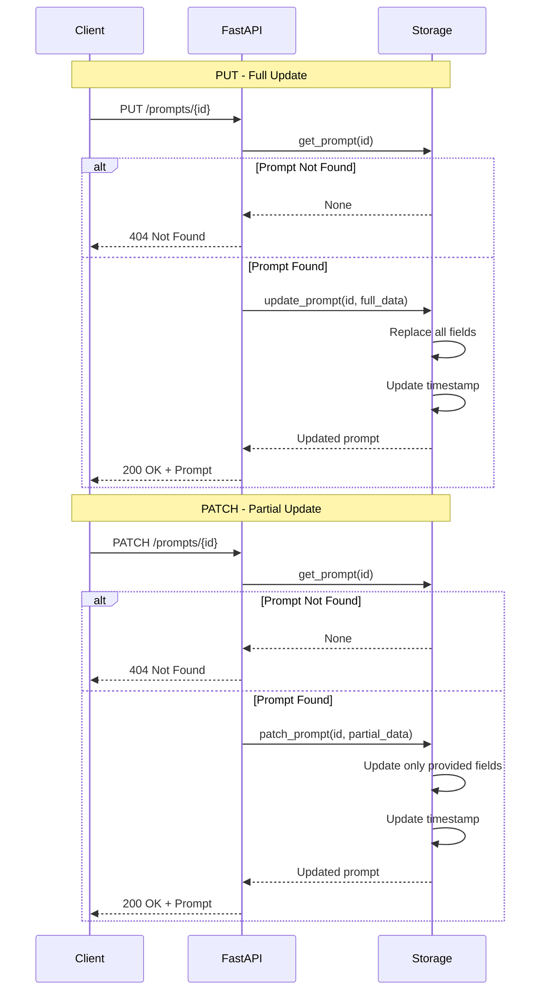
```mermaid
sequenceDiagram
    participant Client
    participant FastAPI
    participant Storage
    
    Note over Client,Storage: PUT - Full Update
    Client->>FastAPI: PUT /prompts/{id}
    FastAPI->>Storage: get_prompt(id)
    
    alt Prompt Not Found
        Storage-->>FastAPI: None
        FastAPI-->>Client: 404 Not Found
    else Prompt Found
        FastAPI->>Storage: update_prompt(id, full_data)
        Storage->>Storage: Replace all fields
        Storage->>Storage: Update timestamp
        Storage-->>FastAPI: Updated prompt
        FastAPI-->>Client: 200 OK + Prompt
    end
    
    Note over Client,Storage: PATCH - Partial Update
    Client->>FastAPI: PATCH /prompts/{id}
    FastAPI->>Storage: get_prompt(id)
    
    alt Prompt Not Found
        Storage-->>FastAPI: None
        FastAPI-->>Client: 404 Not Found
    else Prompt Found
        FastAPI->>Storage: patch_prompt(id, partial_data)
        Storage->>Storage: Update only provided fields
        Storage->>Storage: Update timestamp
        Storage-->>FastAPI: Updated prompt
        FastAPI-->>Client: 200 OK + Prompt
    end
```

---

## Entity Relationships

### Database Schema (Conceptual)

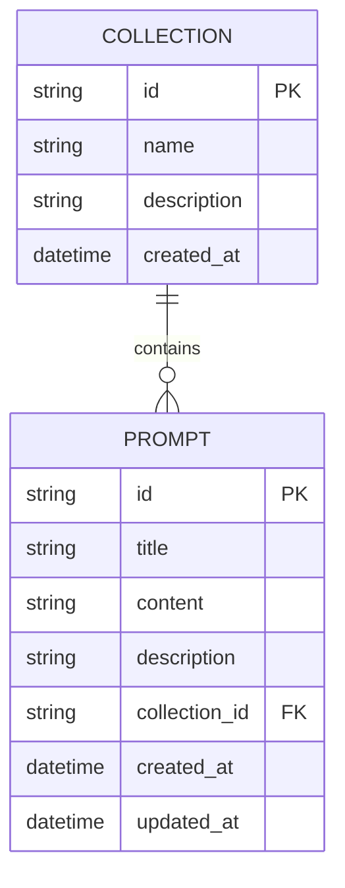
```mermaid
erDiagram
    COLLECTION ||--o{ PROMPT : contains
    
    COLLECTION {
        string id PK
        string name
        string description
        datetime created_at
    }
    
    PROMPT {
        string id PK
        string title
        string content
        string description
        string collection_id FK
        datetime created_at
        datetime updated_at
    }
```

### Relationship Rules

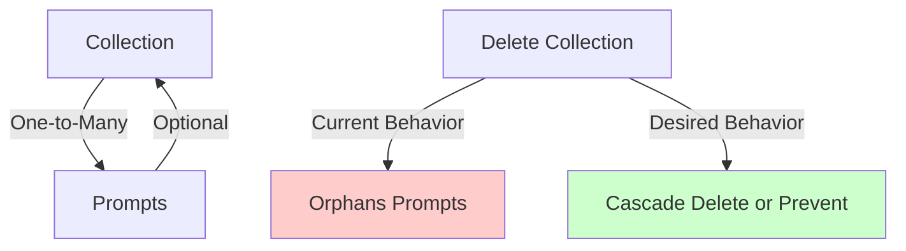
```mermaid
graph TD
    A[Collection] -->|One-to-Many| B[Prompts]
    B -->|Optional| A
    
    C[Delete Collection] -->|Current Behavior| D[Orphans Prompts]
    C -->|Desired Behavior| E[Cascade Delete or Prevent]
    
    style D fill:#ffcccc
    style E fill:#ccffcc
```

---

## Resource Lifecycle

### Prompt Lifecycle

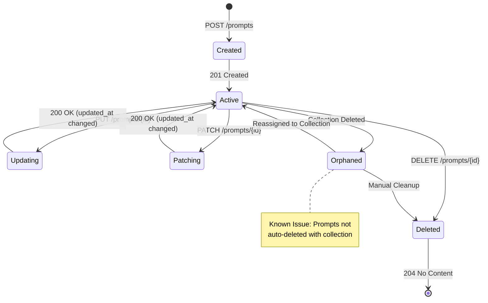
```mermaid
stateDiagram-v2
    [*] --> Created: POST /prompts
    Created --> Active: 201 Created
    
    Active --> Updating: PUT /prompts/{id}
    Updating --> Active: 200 OK (updated_at changed)
    
    Active --> Patching: PATCH /prompts/{id}
    Patching --> Active: 200 OK (updated_at changed)
    
    Active --> Deleted: DELETE /prompts/{id}
    Deleted --> [*]: 204 No Content
    
    Active --> Orphaned: Collection Deleted
    Orphaned --> Active: Reassigned to Collection
    Orphaned --> Deleted: Manual Cleanup
    
    note right of Orphaned
        Known Issue: Prompts not
        auto-deleted with collection
    end note
```

### Collection Lifecycle

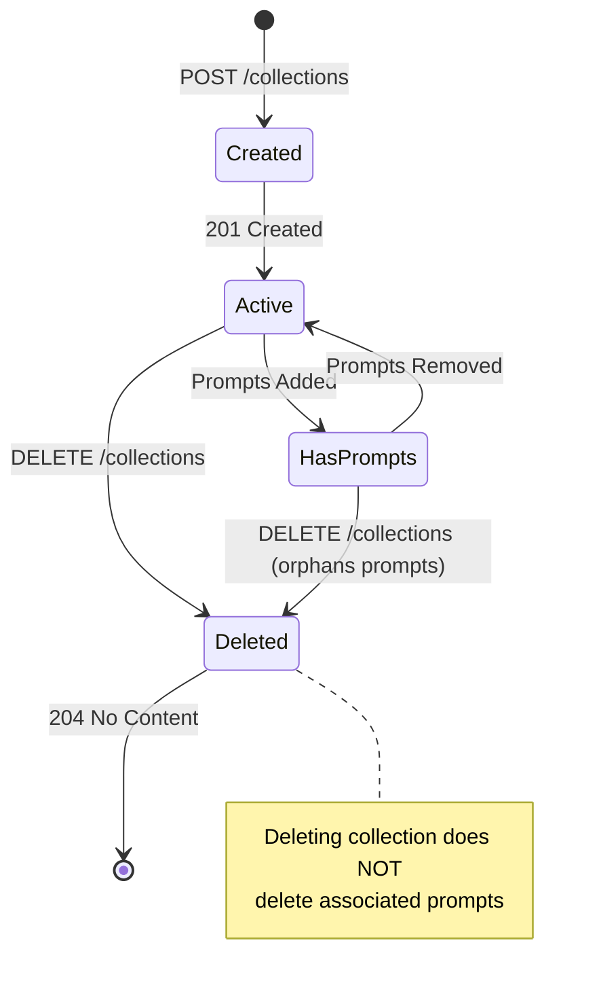
```mermaid
stateDiagram-v2
    [*] --> Created: POST /collections
    Created --> Active: 201 Created
    
    Active --> HasPrompts: Prompts Added
    HasPrompts --> Active: Prompts Removed
    
    Active --> Deleted: DELETE /collections
    HasPrompts --> Deleted: DELETE /collections (orphans prompts)
    Deleted --> [*]: 204 No Content
    
    note right of Deleted
        Deleting collection does NOT
        delete associated prompts
    end note
```

---

## System Architecture

### Layer Architecture

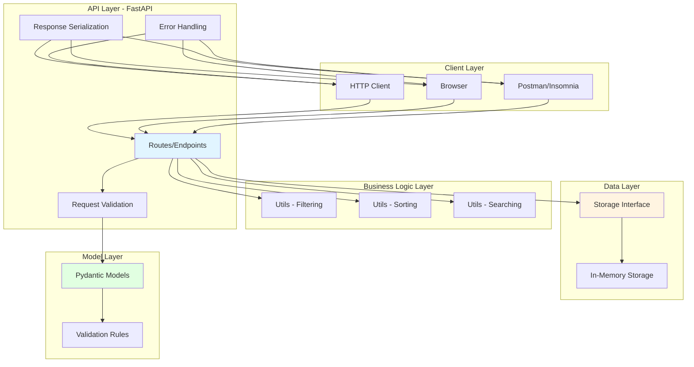
```mermaid
graph TB
    subgraph "Client Layer"
        A[HTTP Client]
        B[Browser]
        C[Postman/Insomnia]
    end
    
    subgraph "API Layer - FastAPI"
        D[Routes/Endpoints]
        E[Request Validation]
        F[Response Serialization]
        G[Error Handling]
    end
    
    subgraph "Business Logic Layer"
        H[Utils - Filtering]
        I[Utils - Sorting]
        J[Utils - Searching]
    end
    
    subgraph "Data Layer"
        K[Storage Interface]
        L[In-Memory Storage]
    end
    
    subgraph "Model Layer"
        M[Pydantic Models]
        N[Validation Rules]
    end
    
    A --> D
    B --> D
    C --> D
    
    D --> E
    E --> M
    M --> N
    
    D --> H
    D --> I
    D --> J
    
    D --> K
    K --> L
    
    F --> A
    F --> B
    F --> C
    
    G --> A
    G --> B
    G --> C
    
    style D fill:#e1f5ff
    style K fill:#fff4e1
    style M fill:#e1ffe1
```

### Request Processing Pipeline

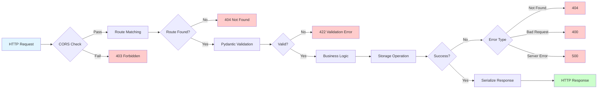
```mermaid
flowchart LR
    A[HTTP Request] --> B{CORS Check}
    B -->|Pass| C[Route Matching]
    B -->|Fail| Z[403 Forbidden]
    
    C --> D{Route Found?}
    D -->|No| Z1[404 Not Found]
    D -->|Yes| E[Pydantic Validation]
    
    E --> F{Valid?}
    F -->|No| Z2[422 Validation Error]
    F -->|Yes| G[Business Logic]
    
    G --> H[Storage Operation]
    H --> I{Success?}
    
    I -->|No| J{Error Type}
    J -->|Not Found| Z3[404]
    J -->|Bad Request| Z4[400]
    J -->|Server Error| Z5[500]
    
    I -->|Yes| K[Serialize Response]
    K --> L[HTTP Response]
    
    style A fill:#e1f5ff
    style L fill:#ccffcc
    style Z fill:#ffcccc
    style Z1 fill:#ffcccc
    style Z2 fill:#ffcccc
    style Z3 fill:#ffcccc
    style Z4 fill:#ffcccc
    style Z5 fill:#ffcccc
```

### Storage Pattern (Current vs Future)

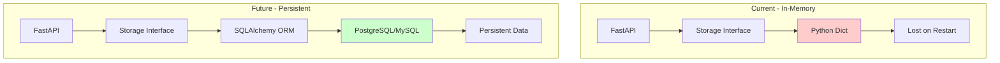
```mermaid
graph TB
    subgraph "Current - In-Memory"
        A1[FastAPI] --> B1[Storage Interface]
        B1 --> C1[Python Dict]
        C1 --> D1[Lost on Restart]
    end
    
    subgraph "Future - Persistent"
        A2[FastAPI] --> B2[Storage Interface]
        B2 --> C2[SQLAlchemy ORM]
        C2 --> D2[PostgreSQL/MySQL]
        D2 --> E2[Persistent Data]
    end
    
    style C1 fill:#ffcccc
    style D2 fill:#ccffcc
```

---

## Component Interaction

### File Dependencies

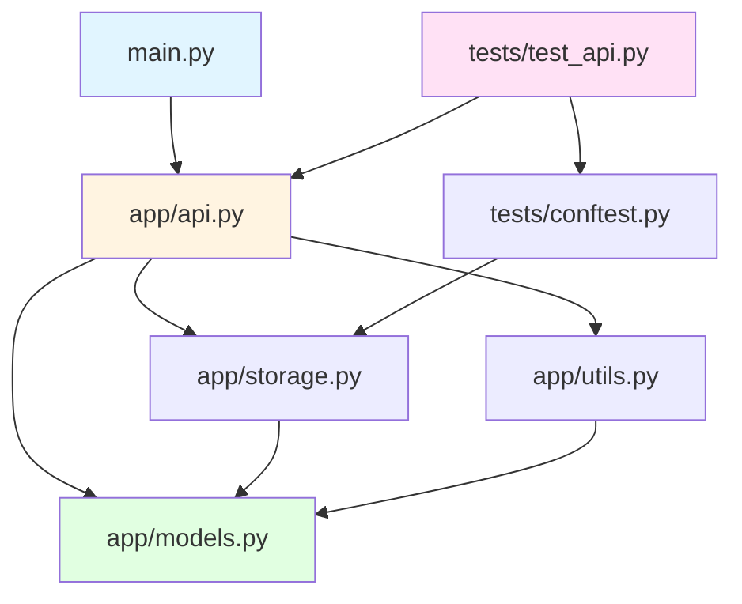
```mermaid
graph TD
    A[main.py] --> B[app/api.py]
    B --> C[app/models.py]
    B --> D[app/storage.py]
    B --> E[app/utils.py]
    
    D --> C
    E --> C
    
    F[tests/test_api.py] --> B
    F --> G[tests/conftest.py]
    G --> D
    
    style A fill:#e1f5ff
    style B fill:#fff4e1
    style C fill:#e1ffe1
    style F fill:#ffe1f5
```

### Module Responsibilities

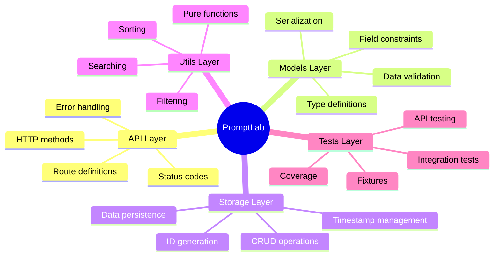
```mermaid
mindmap
    root((PromptLab))
        API Layer
            Route definitions
            HTTP methods
            Status codes
            Error handling
        Models Layer
            Data validation
            Serialization
            Type definitions
            Field constraints
        Storage Layer
            CRUD operations
            Data persistence
            ID generation
            Timestamp management
        Utils Layer
            Filtering
            Sorting
            Searching
            Pure functions
        Tests Layer
            API testing
            Fixtures
            Coverage
            Integration tests
```

---

## Error Handling Flow

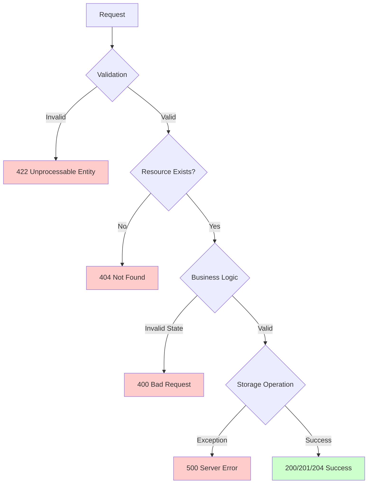
```mermaid
flowchart TD
    A[Request] --> B{Validation}
    B -->|Invalid| C[422 Unprocessable Entity]
    B -->|Valid| D{Resource Exists?}
    
    D -->|No| E[404 Not Found]
    D -->|Yes| F{Business Logic}
    
    F -->|Invalid State| G[400 Bad Request]
    F -->|Valid| H{Storage Operation}
    
    H -->|Exception| I[500 Server Error]
    H -->|Success| J[200/201/204 Success]
    
    style C fill:#ffcccc
    style E fill:#ffcccc
    style G fill:#ffcccc
    style I fill:#ffcccc
    style J fill:#ccffcc
```

---

## Performance Considerations

### Current Bottlenecks

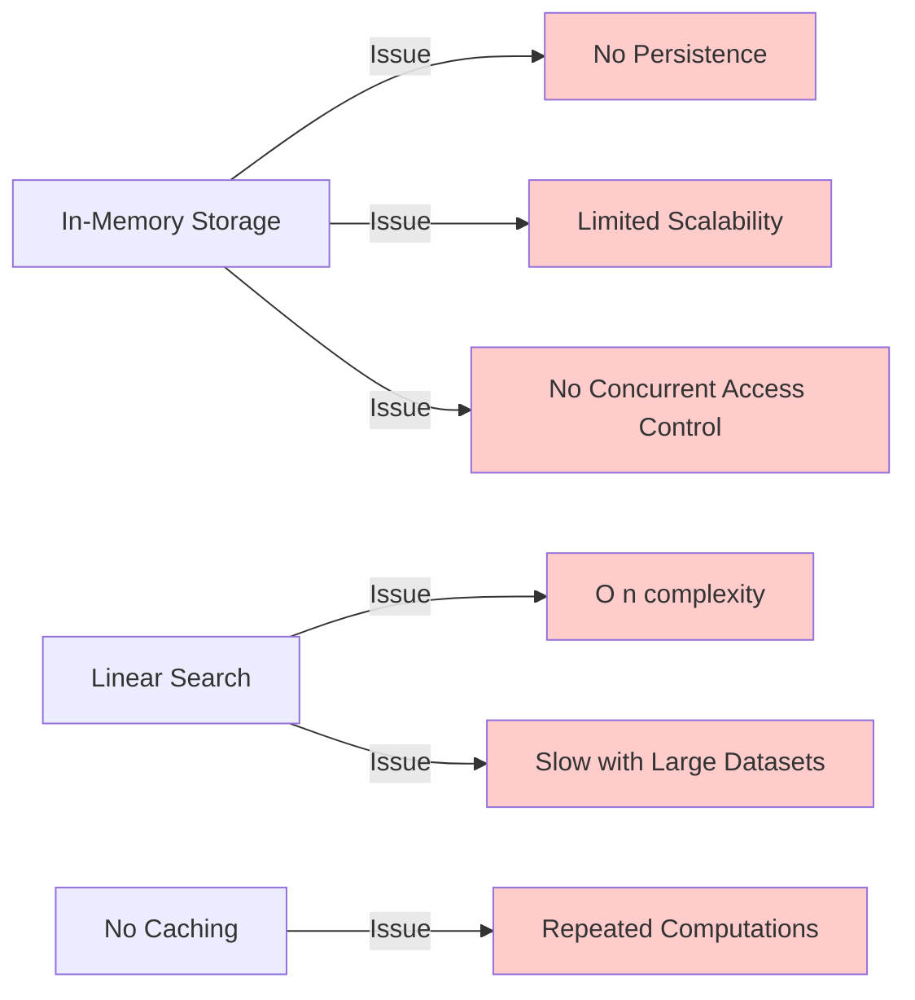
```mermaid
graph LR
    A[In-Memory Storage] -->|Issue| B[No Persistence]
    A -->|Issue| C[Limited Scalability]
    A -->|Issue| D[No Concurrent Access Control]
    
    E[Linear Search] -->|Issue| F[O n complexity]
    E -->|Issue| G[Slow with Large Datasets]
    
    H[No Caching] -->|Issue| I[Repeated Computations]
    
    style B fill:#ffcccc
    style C fill:#ffcccc
    style D fill:#ffcccc
    style F fill:#ffcccc
    style G fill:#ffcccc
    style I fill:#ffcccc
```

### Future Optimizations

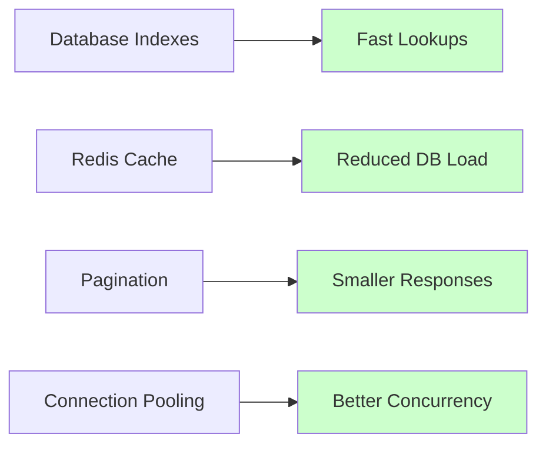
```mermaid
graph LR
    A[Database Indexes] --> B[Fast Lookups]
    C[Redis Cache] --> D[Reduced DB Load]
    E[Pagination] --> F[Smaller Responses]
    G[Connection Pooling] --> H[Better Concurrency]
    
    style B fill:#ccffcc
    style D fill:#ccffcc
    style F fill:#ccffcc
    style H fill:#ccffcc
```

---

## Deployment Architecture (Future)

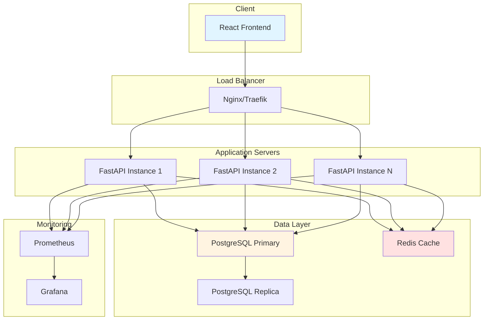
```mermaid
graph TB
    subgraph "Client"
        A[React Frontend]
    end
    
    subgraph "Load Balancer"
        B[Nginx/Traefik]
    end
    
    subgraph "Application Servers"
        C1[FastAPI Instance 1]
        C2[FastAPI Instance 2]
        C3[FastAPI Instance N]
    end
    
    subgraph "Data Layer"
        D[PostgreSQL Primary]
        E[PostgreSQL Replica]
        F[Redis Cache]
    end
    
    subgraph "Monitoring"
        G[Prometheus]
        H[Grafana]
    end
    
    A --> B
    B --> C1
    B --> C2
    B --> C3
    
    C1 --> D
    C2 --> D
    C3 --> D
    
    C1 --> F
    C2 --> F
    C3 --> F
    
    D --> E
    
    C1 --> G
    C2 --> G
    C3 --> G
    G --> H
    
    style A fill:#e1f5ff
    style D fill:#fff4e1
    style F fill:#ffe1e1
```

---

## Summary

This architecture documentation provides visual representations of:

- **Data Models**: How Pydantic models are structured and related
- **Request Flows**: Step-by-step API request processing
- **Entity Relationships**: Database schema and relationships
- **Lifecycles**: State transitions for resources
- **System Architecture**: Overall system design and layers
- **Error Handling**: How errors flow through the system
- **Future Plans**: Scalability and deployment considerations

All diagrams are created with Mermaid and will render automatically on GitHub, GitLab, and in MkDocs with the proper extensions.
