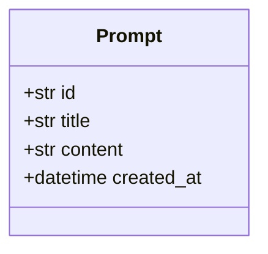

# Interactive Documentation Guide

This guide shows you how to make your PromptLab documentation interactive and visual.

## 1. Interactive API Documentation (Already Built-In!)

FastAPI automatically generates interactive API docs. You already have this running:

### Swagger UI (Recommended)
```
http://localhost:8000/docs
```
- Try out API calls directly in the browser
- See request/response schemas
- Test authentication (when added)
- Download OpenAPI spec

### ReDoc (Alternative)
```
http://localhost:8000/redoc
```
- Cleaner, more readable layout
- Better for sharing with non-technical stakeholders
- Three-panel layout with navigation

### OpenAPI JSON
```
http://localhost:8000/openapi.json
```
- Raw OpenAPI 3.0 specification
- Import into Postman, Insomnia, or other tools

## 2. MkDocs for Project Documentation

MkDocs creates beautiful static documentation sites from Markdown files.

### Installation

```bash
pip install mkdocs mkdocs-material
```

### Setup

Create `mkdocs.yml` in project root:

```yaml
site_name: PromptLab Documentation
theme:
  name: material
  palette:
    primary: indigo
    accent: indigo
  features:
    - navigation.tabs
    - navigation.sections
    - toc.integrate

nav:
  - Home: index.md
  - API Reference: API_REFERENCE.md
  - Architecture: ARCHITECTURE.md
  - Storage: backend/STORAGE.md

markdown_extensions:
  - pymdownx.highlight
  - pymdownx.superfences:
      custom_fences:
        - name: mermaid
          class: mermaid
          format: !!python/name:pymdownx.superfences.fence_code_format
  - admonition
  - codehilite
```

### Commands

```bash
# Serve locally with hot reload
mkdocs serve

# Build static site
mkdocs build

# Deploy to GitHub Pages
mkdocs gh-deploy
```

Visit: `http://127.0.0.1:8000`

## 3. Mermaid Diagrams in Documentation

Mermaid lets you create diagrams using text. GitHub, GitLab, and MkDocs all support it natively.

### In Markdown Files

Just use a mermaid code block:

````markdown

````

### Viewing Mermaid

- **GitHub/GitLab**: Renders automatically in README.md
- **VS Code**: Install "Markdown Preview Mermaid Support" extension
- **MkDocs**: Use `pymdownx.superfences` extension (shown above)
- **Online**: https://mermaid.live/

## 4. Postman/Insomnia Collections

Export your API as a collection for team sharing:

### From OpenAPI Spec

1. Start your server: `python backend/main.py`
2. Download: `http://localhost:8000/openapi.json`
3. Import into Postman/Insomnia
4. Share collection with team

### Postman Features

- Environment variables (dev/staging/prod)
- Pre-request scripts
- Test assertions
- Documentation generation
- Mock servers

## 5. Recommended Setup for PromptLab

### Quick Start (No Installation)

1. **Use FastAPI's built-in docs** - Already working!
   - Visit `http://localhost:8000/docs`
   - Click "Try it out" on any endpoint
   - Execute requests directly

2. **Add Mermaid diagrams to existing docs**
   - Add diagrams to `docs/API_REFERENCE.md`
   - View on GitHub (renders automatically)
   - Or use VS Code with Mermaid extension

### Full Setup (Recommended for Teams)

1. **Install MkDocs**
   ```bash
   pip install mkdocs mkdocs-material
   ```

2. **Create mkdocs.yml** (see template above)

3. **Organize docs**
   ```
   docs/
   ├── index.md              # Project overview
   ├── API_REFERENCE.md      # API endpoints with diagrams
   ├── ARCHITECTURE.md       # System design with Mermaid
   └── DEVELOPMENT.md        # Setup and contribution guide
   ```

4. **Run locally**
   ```bash
   mkdocs serve
   ```

5. **Deploy to GitHub Pages**
   ```bash
   mkdocs gh-deploy
   ```

## 6. Tools Comparison

| Tool | Purpose | Pros | Cons |
|------|---------|------|------|
| **FastAPI Docs** | API testing | Built-in, interactive, auto-generated | Only for API endpoints |
| **MkDocs** | Project docs | Beautiful, searchable, versioned | Requires setup |
| **Mermaid** | Diagrams | Text-based, version-controlled | Limited styling |
| **Postman** | API testing | Team collaboration, environments | External tool |
| **Swagger UI** | API docs | Industry standard, embeddable | Requires OpenAPI spec |

## 7. Next Steps

1. **Immediate**: Use FastAPI's `/docs` endpoint (already working!)
2. **Quick win**: Add Mermaid diagrams to your existing Markdown files
3. **Team setup**: Install MkDocs for comprehensive documentation site
4. **Advanced**: Set up CI/CD to auto-deploy docs on commits

## Example: Adding Mermaid to API_REFERENCE.md

See the updated `docs/API_REFERENCE.md` file for examples of:
- Class diagrams for data models
- Sequence diagrams for request flows
- Entity relationship diagrams
- State diagrams for resource lifecycle

---

**Pro Tip**: Start simple with FastAPI's built-in docs and Mermaid diagrams in Markdown. Add MkDocs later when your documentation grows.
