# Prompt Versioning Feature Specification

## Overview

The Prompt Versioning feature aims to allow users to track changes in their prompts over time. This will include the ability to view previous versions of a prompt, compare changes, and possibly revert to an older version. The feature is intended to enhance usability by providing authors the flexibility to maintain and refine their prompt content history.

## Data Model Diagram

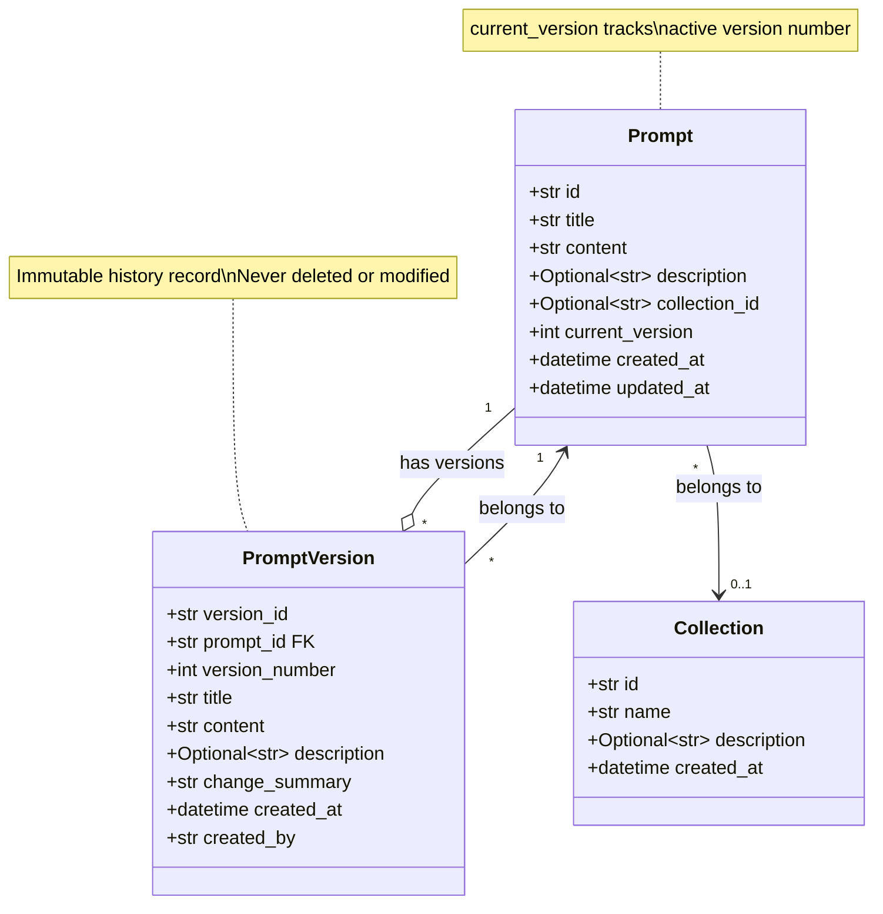

### Version Tracking Strategy

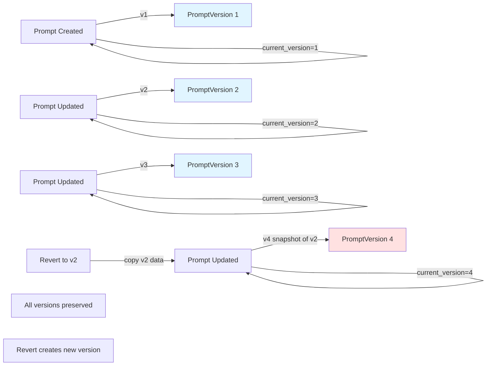

## User Stories

### User Story 1: View Prompt Versions

As a user, I want to be able to see all versions of a prompt so that I can track its history and changes.

**Acceptance Criteria**:
- Users can access a list of all past versions of a specific prompt.
- Each version displays key details such as version number, date modified, and changes made.

### User Story 2: Revert to Previous Version

As a user, I want to revert to a previous version of a prompt so that I can undo changes if necessary.

**Acceptance Criteria**:
- Users can select a previous prompt version and set it as the current version.
- The system confirms the successful restoration of the selected version.

## API Flow Diagrams

### Get All Versions Flow

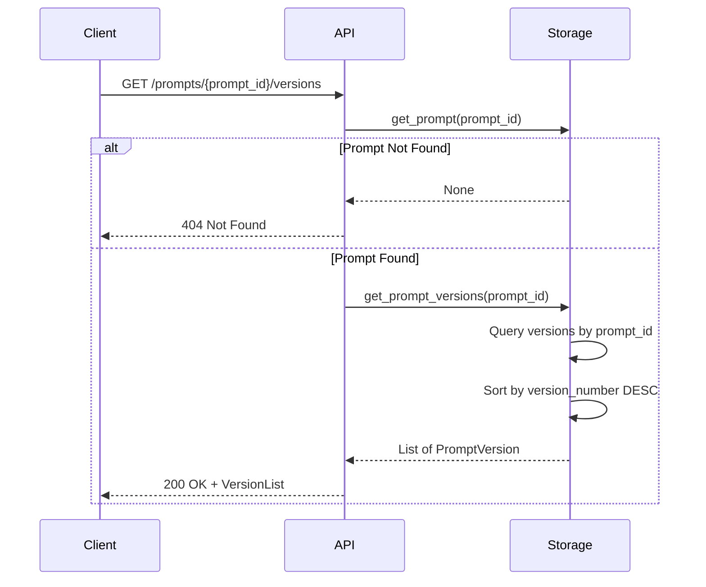

### Revert to Previous Version Flow

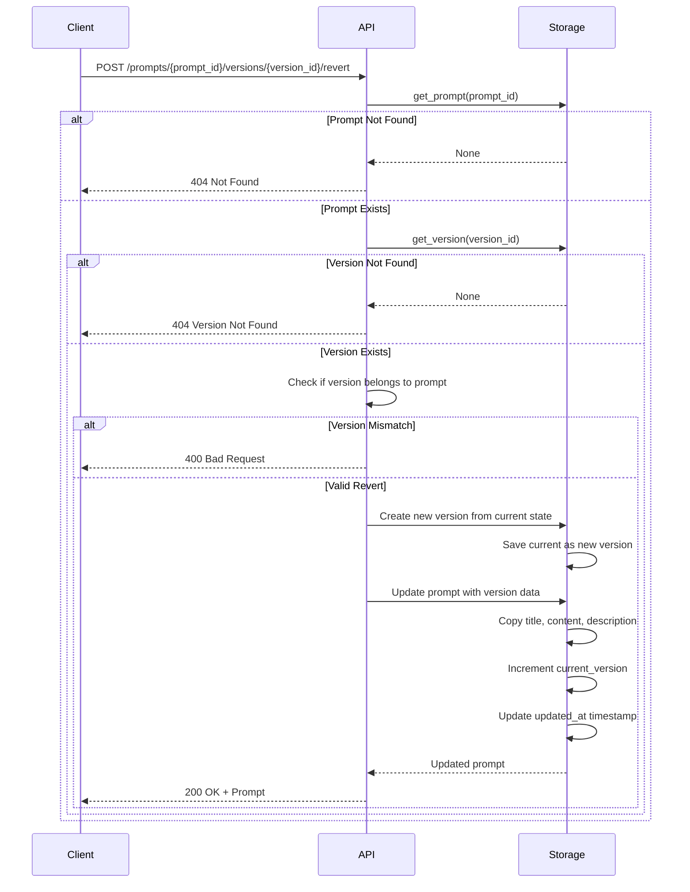

### Create Version on Update Flow

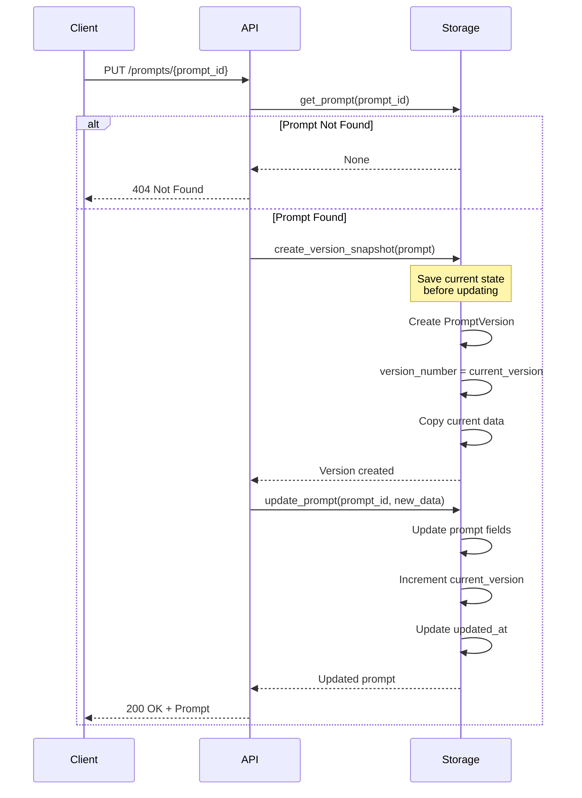

## Data Model Changes

To support prompt versioning, we need to modify and extend the existing data models as follows:

1. **New Model: `PromptVersion`**
   - **Attributes**:
     - `version_id`: Unique identifier for version
     - `prompt_id`: Foreign key linking to the parent prompt
     - `title`: Title of the prompt version
     - `content`: Content of the prompt version
     - `description`: Optional description of the prompt version
     - `created_at`: Timestamp of when the version was created

2. **Update to Existing `Prompt` Model**
   - Add a relation to `PromptVersion` to enable tracking of multiple versions linked to a single prompt.

## API Endpoint Specifications

### Endpoint 1: GET `/prompts/{prompt_id}/versions`

- **Description**: Retrieve all versions of a specific prompt.
- **Request Parameters**: 
  - `prompt_id`: ID of the prompt for which to retrieve versions.
- **Response**:
  ```json
  {
    "versions": [
      {
        "version_id": "string",
        "title": "Version Title",
        "content": "Version Content",
        "description": "Optional Description",
        "created_at": "2023-10-12T10:00:00Z"
      },
      ...
    ],
    "total": 5
  }
  ```

### Endpoint 2: POST `/prompts/{prompt_id}/versions/{version_id}/revert`

- **Description**: Revert a specific prompt to a selected version.
- **Request Parameters**: 
  - `prompt_id`: ID of the prompt to revert.
  - `version_id`: ID of the version to revert to.
- **Response**: 
  - **200 OK**: Confirmation of successful reversion.
  - **Error 404**: If the prompt or version is not found.
  - **Error 409**: If the provided version is already the current prompt version.

## Edge Cases to Handle

1. **Concurrent Modifications**: Ensure that the prompt is not updated concurrently while a reversion attempt is occurring.
2. **Version Limits**: Decide on a policy for how many versions to retain (e.g., maximum number of past versions or a time-based retention).
3. **Data Integrity**: Ensure that reverting to a past version correctly updates references and does not disrupt other dependent data relationships.
4. **Reversion Confirmation**: Provide a confirmation step to users before making irreversible reversion changes.

## Implementation Guide

### Database Schema

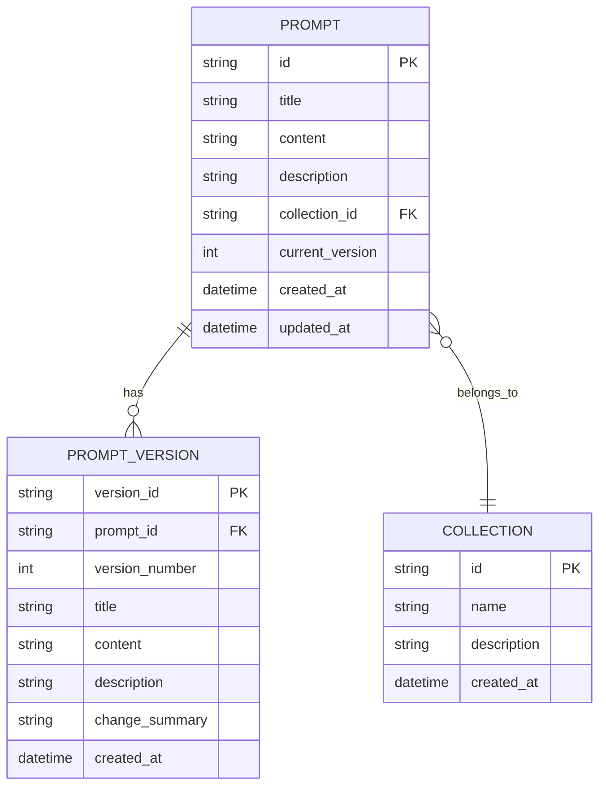

### Version Lifecycle States

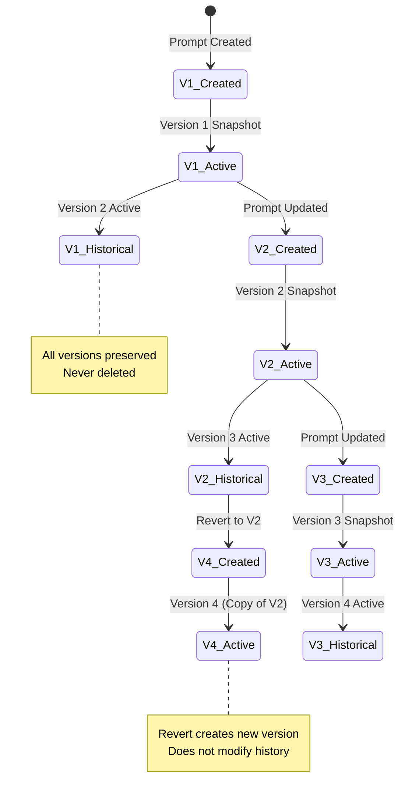

### Pydantic Model Updates

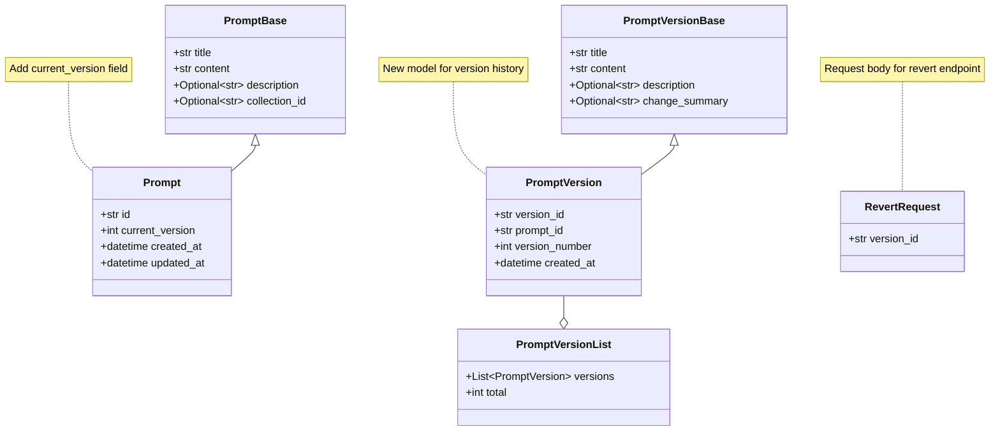

### Implementation Steps

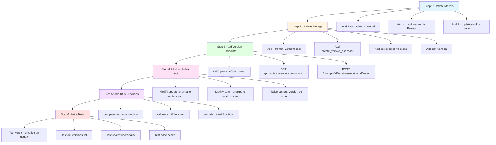

### Storage Layer Changes

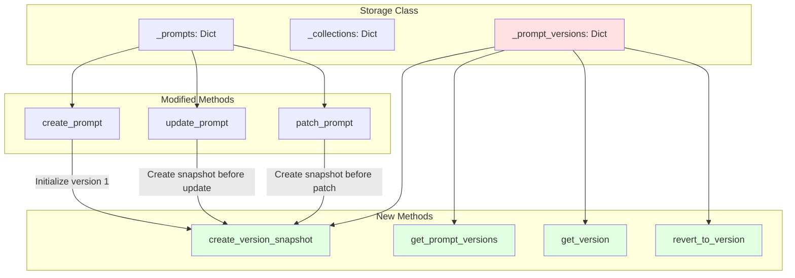

### Version Comparison Feature

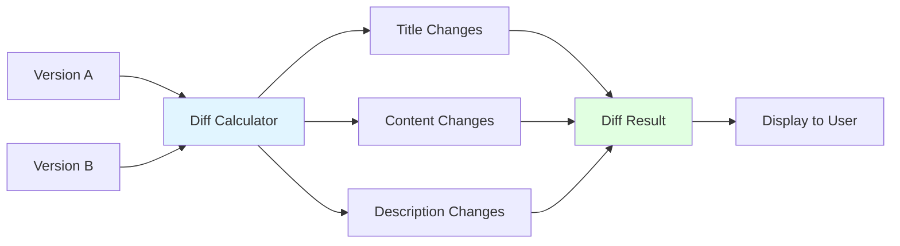

## Testing Strategy

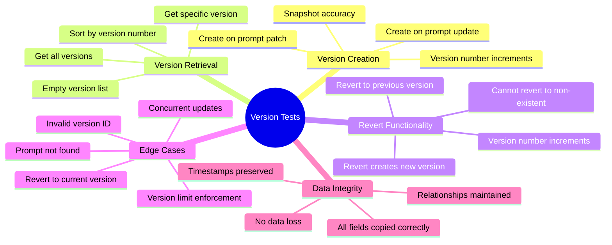

## Performance Considerations

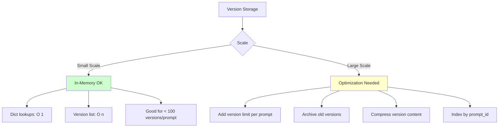

### Version Retention Policy

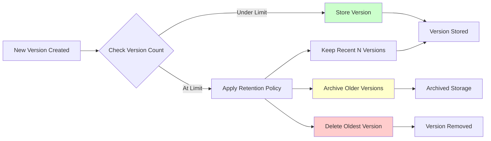

## Future Enhancements

- **Version Comparison UI**: Side-by-side diff view showing changes between versions
- **Version Branching**: Create alternate versions without affecting main history
- **Version Tags**: Label important versions (e.g., "production", "tested")
- **Bulk Revert**: Revert multiple prompts to specific date/time
- **Version Comments**: Add notes explaining why changes were made
- **Change Tracking**: Track who made changes (requires authentication)
- **Automatic Versioning**: Configure when to create versions (every save vs manual)
- **Version Export**: Download version history as JSON/CSV

---

**Implementation Priority**: High  
**Estimated Effort**: 12-16 hours  
**Dependencies**: None (extends existing Prompt model)  
**Breaking Changes**: None (additive feature, adds current_version field)

---


This specification captures the essential details needed to implement the prompt versioning feature. It blends both technical requirements and user interaction considerations to ensure smooth development and deployment.