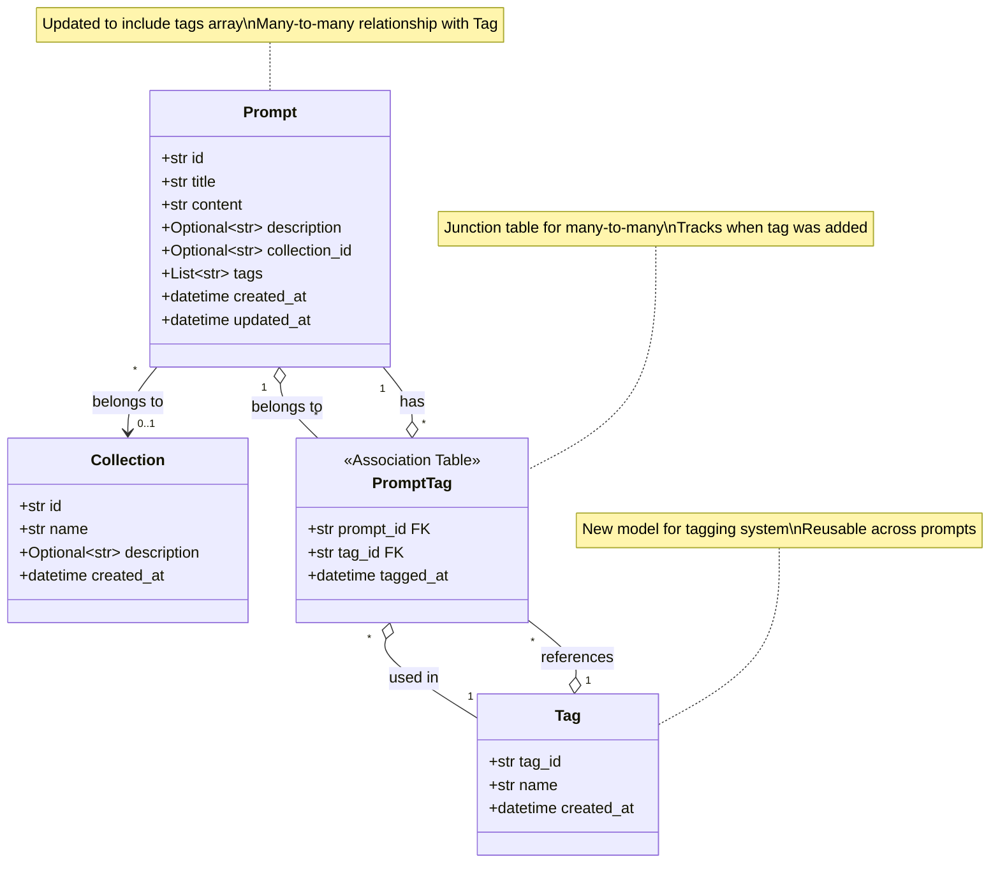
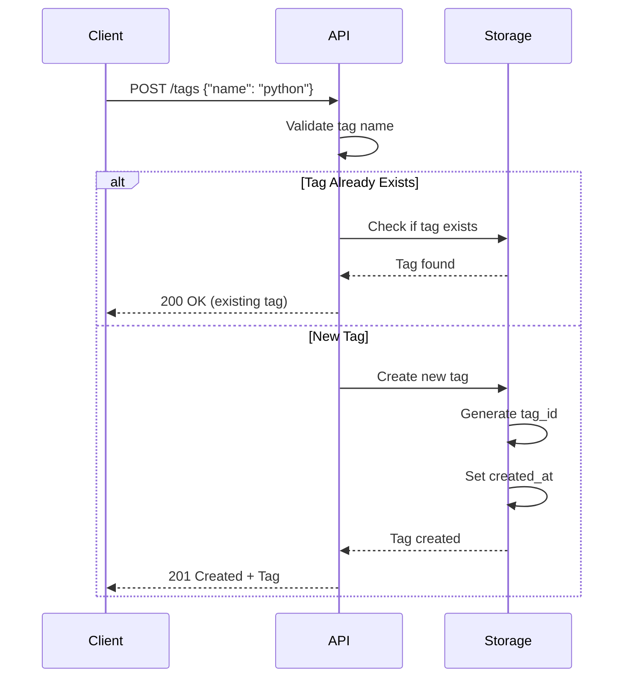
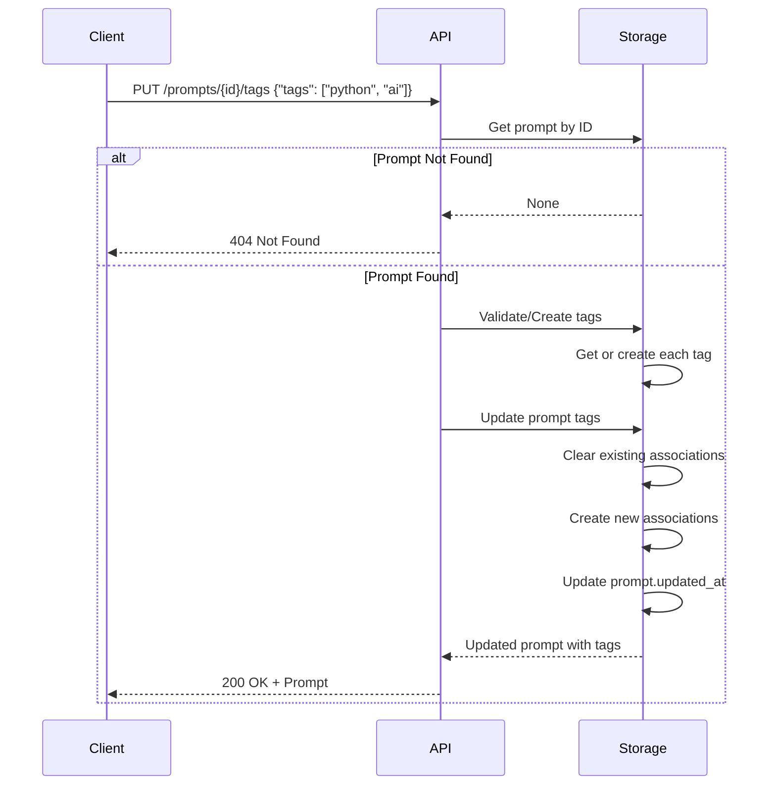
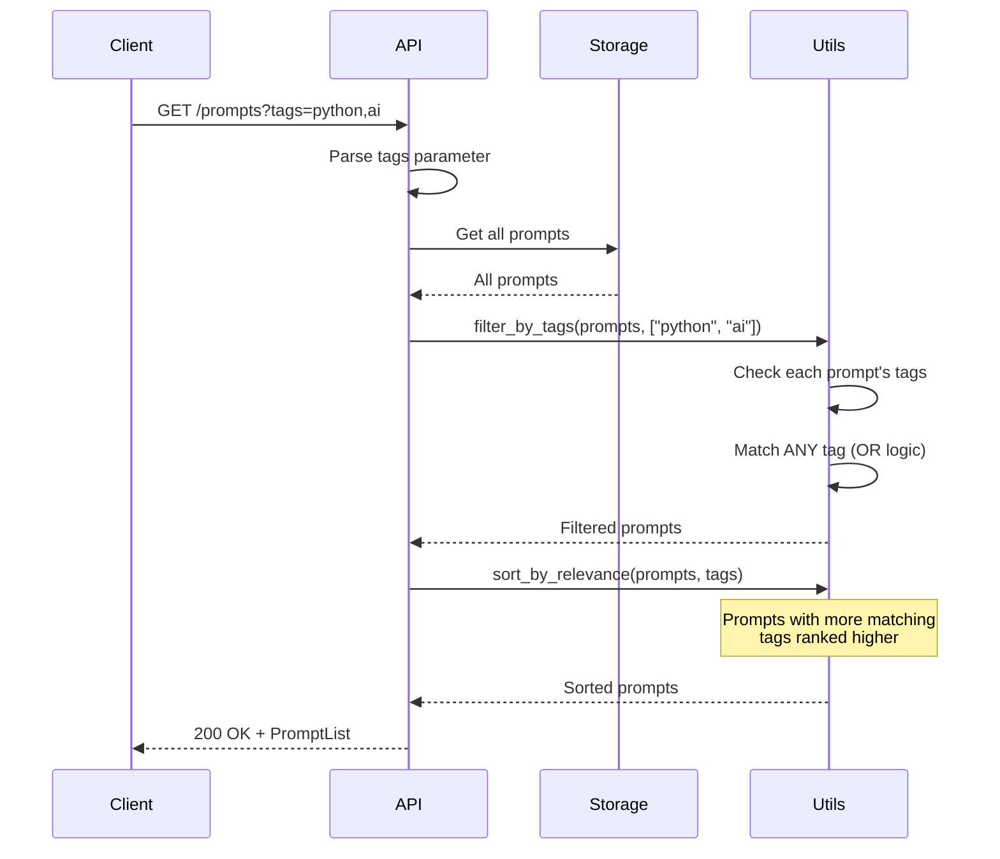
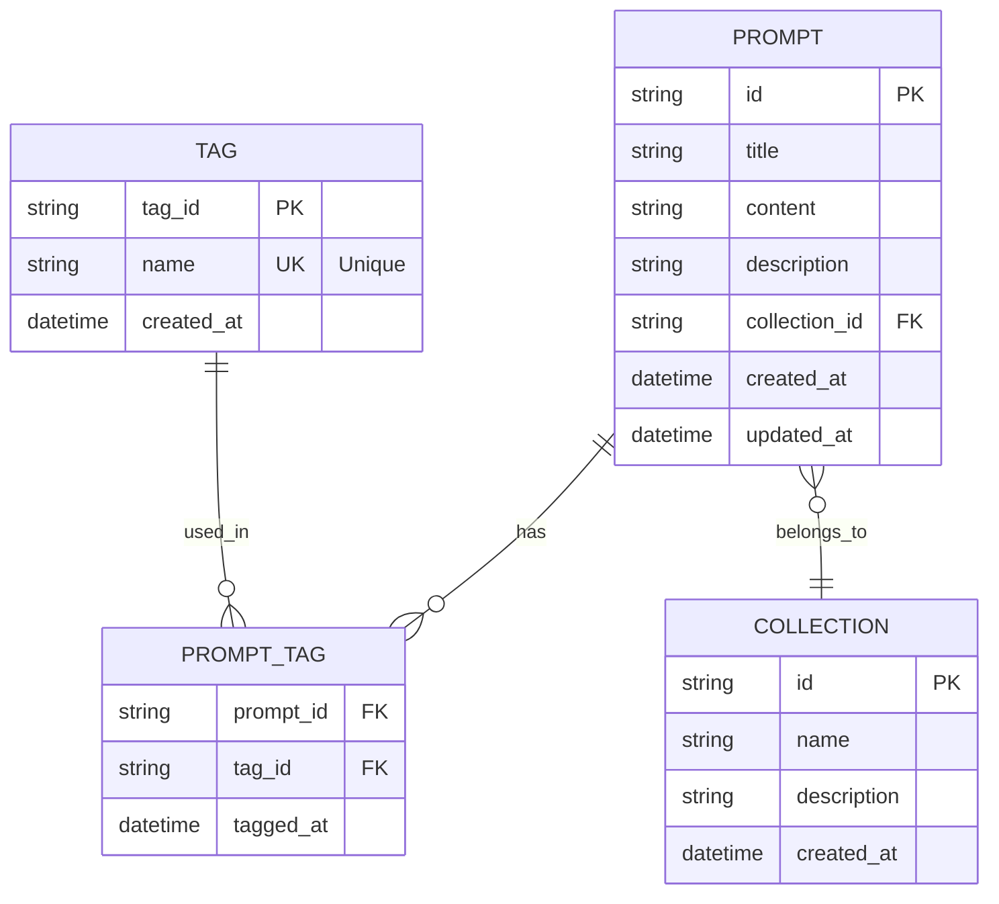
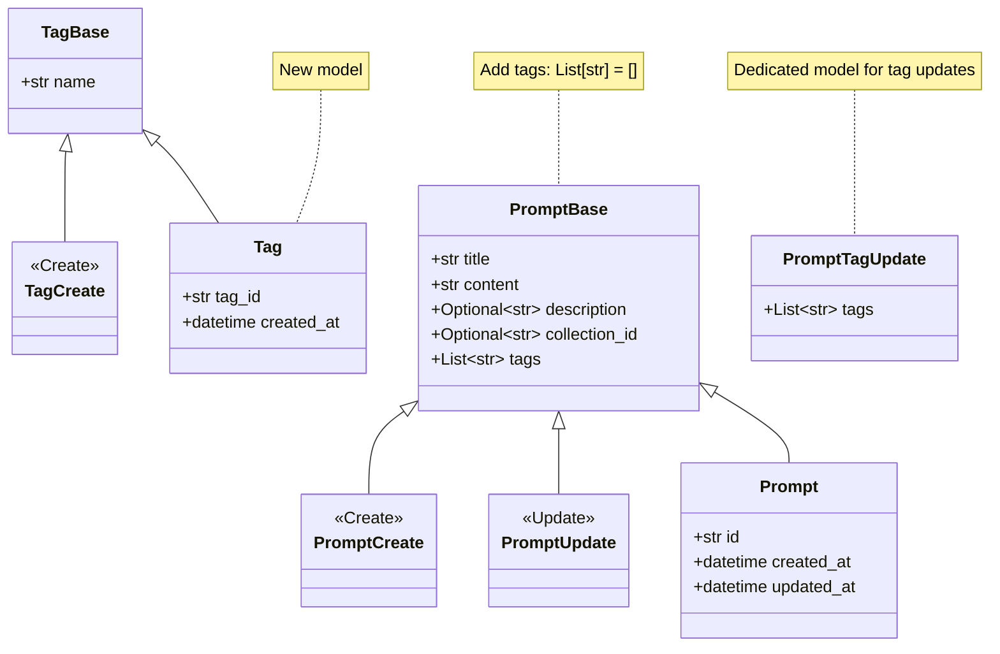
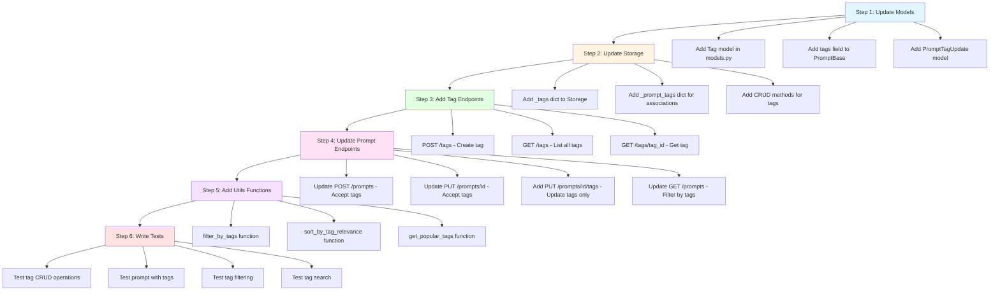
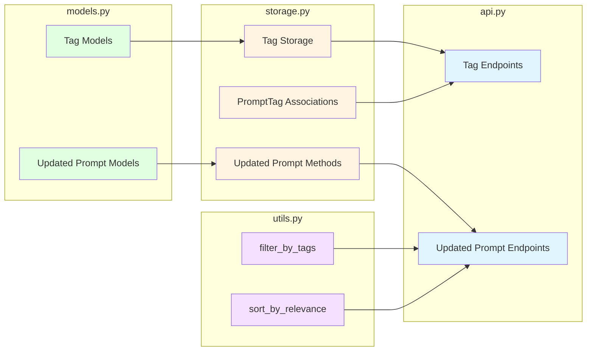
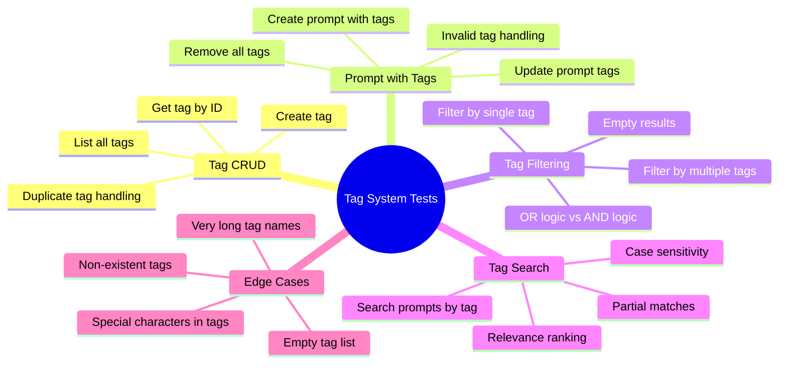
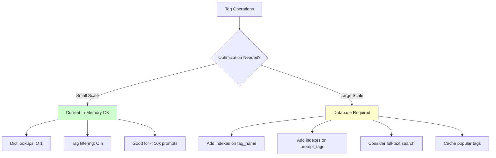

# Tagging System Feature Specification

## Overview

The Tagging System feature introduces the ability to associate tags with prompts. Tags allow users to categorize and organize prompts flexibly, facilitating better searchability and management. By enabling tagging, users can more easily filter and discover prompts relevant to specific themes or topics.

## Data Model Diagram



### Relationship Details

- **Prompt ↔ Tag**: Many-to-many relationship
  - One prompt can have multiple tags
  - One tag can be used by multiple prompts
  - Implemented via `PromptTag` association table
  
- **Prompt → Collection**: Many-to-one relationship (existing)
  - One prompt belongs to zero or one collection
  - One collection can contain multiple prompts

## User Stories

### User Story 1: Add Tags to Prompts

**As a user, I want to tag my prompts with relevant keywords so that I can categorize them for easy retrieval and organization.**

**Acceptance Criteria:**
- Users can assign multiple tags to a prompt at the time of creation or update.
- Tags are displayed alongside prompts to provide immediate context.

### User Story 2: Search by Tags

**As a user, I want to search for prompts by tags so that I can quickly find prompts related to specific themes.**

**Acceptance Criteria:**
- Users can input tags in a search bar to fetch prompts containing those tags.
- Search results display prompts ranked by relevance to the queried tags.

## Data Model Changes

To support tagging functionality, we propose the following data model changes:

1. **New Model: `Tag`**
   - **Attributes:**
     - `tag_id`: Unique identifier for the tag.
     - `name`: The textual name of the tag.

2. **Update to Existing `Prompt` Model**
   - Add a many-to-many relationship with the `Tag` model to link multiple tags to a single prompt.

## API Flow Diagrams

### Create Tag Flow



### Add Tags to Prompt Flow



### Search by Tags Flow



## API Endpoint Specifications

### Endpoint 1: POST `/tags`

- **Description**: Create a new tag.
- **Request**:
  ```json
  {
    "name": "TagName"
  }
  ```
- **Response**:
  ```json
  {
    "tag_id": "string",
    "name": "TagName"
  }
  ```

### Endpoint 2: GET `/prompts?tags=tag1,tag2,...`

- **Description**: Retrieve prompts filtered by associated tags.
- **Request Parameters**: 
  - `tags` (query parameter): Comma-separated list of tag names to filter prompts.
- **Response**:
  ```json
  {
    "prompts": [
      {
        "id": "string",
        "title": "Prompt Title",
        "content": "Prompt Content",
        "description": "Optional description",
        "collection_id": "string",
        "tags": ["Tag1", "Tag2"],
        "created_at": "2023-10-12T10:00:00Z",
        "updated_at": "2023-10-12T10:00:00Z"
      }
    ],
    "total": 1
  }
  ```

### Endpoint 3: PUT `/prompts/{prompt_id}/tags`

- **Description**: Update tags associated with a specific prompt.
- **Request**:
  ```json
  {
    "tags": ["NewTag1", "NewTag2"]
  }
  ```
- **Response**:
  ```json
  {
    "id": "string",
    "title": "Prompt Title",
    "content": "Prompt Content",
    "description": "Optional description",
    "collection_id": "string",
    "tags": ["NewTag1", "NewTag2"],
    "created_at": "2023-10-12T10:00:00Z",
    "updated_at": "2023-10-12T10:00:00Z"
  }


## Implementation Guide

### Database Schema Changes



### Pydantic Model Updates



### Implementation Steps



### Code Structure Changes



## Testing Strategy

### Test Coverage Requirements



## Performance Considerations



## Future Enhancements

- **Tag Autocomplete**: Suggest existing tags as user types
- **Tag Analytics**: Show most popular tags, tag usage over time
- **Tag Hierarchies**: Parent/child tag relationships (e.g., "python" → "python-3.10")
- **Tag Synonyms**: Map similar tags (e.g., "ML" → "machine-learning")
- **Tag Colors**: Visual categorization with color coding
- **Tag Permissions**: Control who can create/use certain tags

---

**Implementation Priority**: Medium  
**Estimated Effort**: 8-12 hours  
**Dependencies**: None (extends existing Prompt model)  
**Breaking Changes**: None (additive feature)
